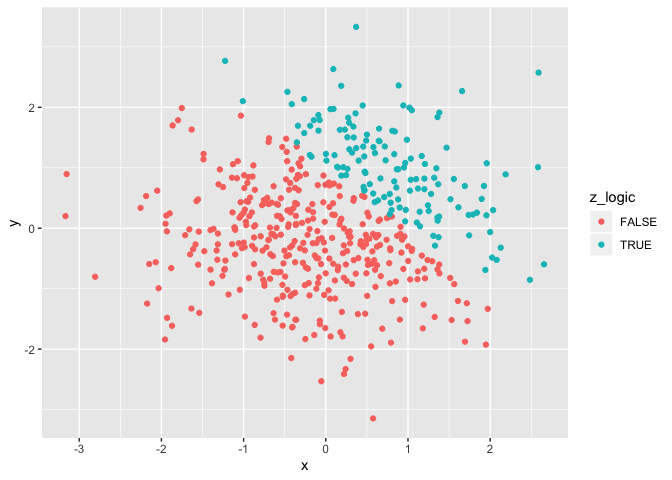
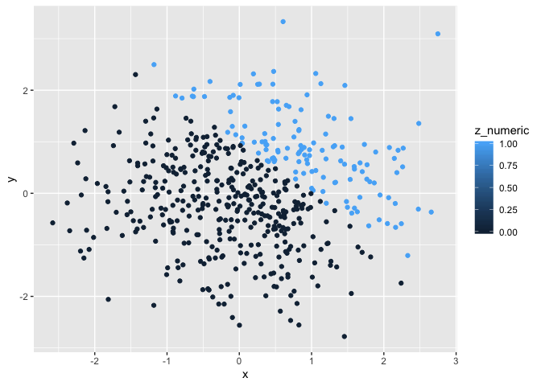
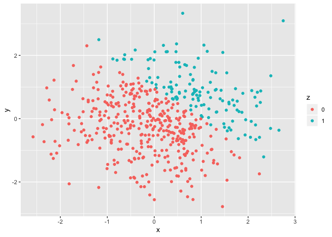

P8105 HW1
================
Xinyu Yang

This is the R Markdown for P8150 Homework 1  
<br>

## Problem 1

<br> **Create data frame**

``` r
#load the tidyverse package
library(tidyverse)
```

    ## ── Attaching packages ─────────────────────────────────────── tidyverse 1.2.1 ──

    ## ✔ ggplot2 3.2.1     ✔ purrr   0.3.2
    ## ✔ tibble  2.1.3     ✔ dplyr   0.8.3
    ## ✔ tidyr   0.8.3     ✔ stringr 1.4.0
    ## ✔ readr   1.3.1     ✔ forcats 0.4.0

    ## ── Conflicts ────────────────────────────────────────── tidyverse_conflicts() ──
    ## ✖ dplyr::filter() masks stats::filter()
    ## ✖ dplyr::lag()    masks stats::lag()

``` r
#Set seed for random sampling
set.seed(123)

#Create data frame p1_df
p1_df = tibble(
  ran_sample = rnorm(8),
  vec_char = c("This", "is", "an", "example", "of", "the", "char", "vector"),
  vec_logical = ran_sample > 0,
  vec_factor = factor(c("Yes", "No", "Maybe", "Maybe", "Yes", "No", "Yes", "No")) 
)
```

<br>

**Compute mean for each variable in data frame**

``` r
#Compute means
mean(pull(p1_df, ran_sample))
```

    ## [1] 0.2348464

``` r
mean(pull(p1_df, vec_char))
```

    ## Warning in mean.default(pull(p1_df, vec_char)): argument is not numeric or
    ## logical: returning NA

    ## [1] NA

``` r
mean(pull(p1_df, vec_logical))
```

    ## [1] 0.625

``` r
mean(pull(p1_df, vec_factor))
```

    ## Warning in mean.default(pull(p1_df, vec_factor)): argument is not numeric
    ## or logical: returning NA

    ## [1] NA

As seen above, among the 4 variables, mean can be computed for the
random sample and the logical vector, but cannot be computed for the
character or factor vector, which returns ‘NA’ as result.  
<br>

**Apply as.numeric and convert**

``` r
as.numeric(pull(p1_df, vec_char))
as.numeric(pull(p1_df, vec_logical))
as.numeric(pull(p1_df, vec_factor))
```

When ‘as.numeric’ is applied, character vector returns ‘NA’ by coercion,
while logical and factor vectors return numeric values. This indicates
that logical and factor vectors can be coerced into numeric values but
character vector can’t. This helps explain why logical vector can be
used to compute mean, but doesn’t explain why factor vector
can’t.

``` r
#convert the logical vector to numeric, and multiply the random sample by the result
convert_1 = as.numeric(pull(p1_df, vec_logical))
convert_1 * pull(p1_df, ran_sample)
```

    ## [1] 0.00000000 0.00000000 1.55870831 0.07050839 0.12928774 1.71506499
    ## [7] 0.46091621 0.00000000

``` r
#convert the logical vector to a factor, and multiply the random sample by the result
convert_2 = as.factor(pull(p1_df, vec_logical))
convert_2 * pull(p1_df, ran_sample)
```

    ## Warning in Ops.factor(convert_2, pull(p1_df, ran_sample)): '*' not
    ## meaningful for factors

    ## [1] NA NA NA NA NA NA NA NA

``` r
#convert the logical vector to a factor and then convert the result to numeric, and multiply the random sample by the result
convert_3 = as.factor(pull(p1_df, vec_logical))
convert_3 = as.numeric(convert_3)
convert_3 * pull(p1_df, ran_sample)
```

    ## [1] -0.5604756 -0.2301775  3.1174166  0.1410168  0.2585755  3.4301300
    ## [7]  0.9218324 -1.2650612

As seen above, when the logical vector is ultimately converted to
numeric, it can be multiplied by the random sample; however, when it is
only converted into a factor, it cannot be multiplied by the random
sample.

-----

## Problem 2

<br> **Create data frame**

``` r
set.seed(12345)

p2_df = tibble(
  x = rnorm(500),
  y = rnorm(500),
  z_logic = (x + y > 1),
  z_numeric = as.numeric(z_logic),
  z = as.factor(z_numeric)
)
```

  - The dataset contains 500 rows and 5 columns.  
  - For sample x, the mean is 0.08, the median is 0.1, and the standard
    deviation is 0.99
  - 26% of sample x satisfy that x + y \> 1

<br>

**Scatterplots of Y vs X**

*Scatterplot 1*: group by logical variable (see below)

``` r
#Generate the first scatterplot, color points using the logical variable
ggplot(p2_df, aes(x = x, y = y, color = z_logic)) + geom_point()
```

<!-- -->

``` r
#Export the scatterplot to project directory
ggsave("scatter_plot.pdf", height = 4, width = 6)
```

<br> *Scatterplot 2*: group by numeric variable (see
below)

``` r
#Generate the second scatterplot, color points using the numeric variable
ggplot(p2_df, aes(x = x, y = y, color = z_numeric)) + geom_point()
```

<!-- -->

<br> *Scatterplot 3*: group by factor variable (see below)

``` r
#Generate the third scatterplot, color points using the factor variable
ggplot(p2_df, aes(x = x, y = y, color = z)) + geom_point()
```

<!-- -->
