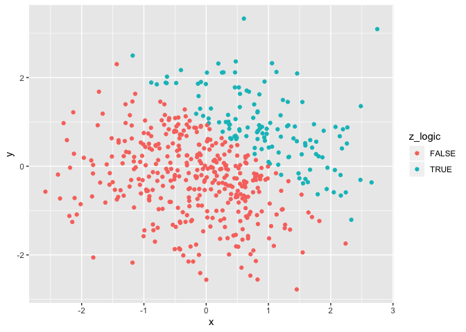

P8105 HW1
================
Xinyu Yang

This is the R Markdown for P8150 Homework 1  
<br>

## Problem 1

<br> **Create data frame and load
    pakage**

``` r
library(tidyverse)
```

    ## ── Attaching packages ──────────────────────────────── tidyverse 1.2.1 ──

    ## ✔ ggplot2 3.2.1     ✔ purrr   0.3.2
    ## ✔ tibble  2.1.3     ✔ dplyr   0.8.3
    ## ✔ tidyr   0.8.3     ✔ stringr 1.4.0
    ## ✔ readr   1.3.1     ✔ forcats 0.4.0

    ## ── Conflicts ─────────────────────────────────── tidyverse_conflicts() ──
    ## ✖ dplyr::filter() masks stats::filter()
    ## ✖ dplyr::lag()    masks stats::lag()

``` r
p1_df = tibble(
  ran_sample = rnorm(8),
  vec_char = character(8),
  vec_logical = ran_sample > 0,
  vec_factor = factor(levels = c("level1", "level2", "level3"), length(8))
)
```

<br>

**Compute mean for each variable in data
    frame**

``` r
mean(pull(p1_df, ran_sample))
```

    ## [1] 0.2073658

``` r
mean(pull(p1_df, vec_char))
```

    ## Warning in mean.default(pull(p1_df, vec_char)): argument is not numeric or
    ## logical: returning NA

    ## [1] NA

``` r
mean(pull(p1_df, vec_logical))
```

    ## [1] 0.625

``` r
mean(pull(p1_df, vec_factor))
```

    ## Warning in mean.default(pull(p1_df, vec_factor)): argument is not numeric
    ## or logical: returning NA

    ## [1] NA

As seen above, among the 4 variables, mean can be computed for the
random sample and the logical vector, but cannot be computed for the
character or factor vector.  
<br>

**Apply as.numeric and convert**

``` r
as.numeric(pull(p1_df, vec_char))
as.numeric(pull(p1_df, vec_logical))
as.numeric(pull(p1_df, vec_factor))
```

When ‘as.numeric’ is applied, character vector and factor vector showed
‘NA’ while logical vector showed ‘0’ or ‘1’. This indicates that
logical vector can be treated as numeric, which helps explain why
logical vector can be used to compute mean while the other two can’t.

``` r
convert_1 = as.numeric(pull(p1_df, vec_logical))
convert_1 * pull(p1_df, ran_sample)
```

    ## [1] 0.0000000 0.3234797 1.0793281 0.8266546 0.0000000 0.8692794 0.0000000
    ## [8] 0.2906189

``` r
convert_2 = as.factor(pull(p1_df, vec_logical))
convert_2 * pull(p1_df, ran_sample)
```

    ## Warning in Ops.factor(convert_2, pull(p1_df, ran_sample)): '*' not
    ## meaningful for factors

    ## [1] NA NA NA NA NA NA NA NA

``` r
convert_3 = as.factor(pull(p1_df, vec_logical))
convert_3 = as.numeric(convert_3)
convert_3 * pull(p1_df, ran_sample)
```

    ## [1] -0.103998159  0.646959443  2.158656294  1.653309199 -1.620162184
    ## [6]  1.738558762 -0.006273662  0.581237706

-----

## Problem 2

<br> **Create data frame**

``` r
p2_df = tibble(
  x = rnorm(500),
  y = rnorm(500),
  z_logic = (x + y > 1),
  z_numeric = as.numeric(z_logic),
  z = as.factor(z_numeric)
)
```

  - The dataset contains 500 rows and 5 columns.  
  - For sample x, the mean is 0.02, the median is 0.04, and the standard
    deviation is 0.98
  - 27.4% of sample x satisfy that x + y \> 1

<br>

**Scatterplots of Y vs X**

*Scatterplot 1*: group by logical variable (see below)

``` r
ggplot(p2_df, aes(x = x, y = y, color = z_logic)) + geom_point()
```

<!-- -->

``` r
ggsave("scatter_plot.pdf", height = 4, width = 6)
```

<br> *Scatterplot 2*: group by numeric variable (see below)

``` r
ggplot(p2_df, aes(x = x, y = y, color = z_numeric)) + geom_point()
```

<!-- -->

<br> *Scatterplot 3*: group by factor variable (see below)

``` r
ggplot(p2_df, aes(x = x, y = y, color = z)) + geom_point()
```

<!-- -->
